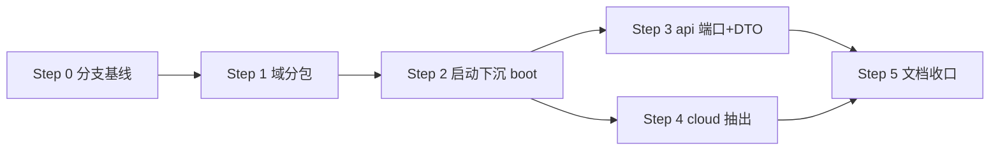

# 目标

在**保持微服务开发形态**的前提下，调整模块划分与跨模块契约，使业务代码可近乎原样抽离到独立 Spring Boot 单体工程。本轮只做「双形态兼容」相关的结构调整与契约约定，不铺业务功能。

成功标准：

1. `*-api` 成为跨域唯一契约面（端口接口 + DTO），业务代码不依赖对方 `*-service` 内部。
2. `*-service` 退化为纯业务库（无 `@SpringBootApplication`），可部署单元落在 `amao-boot`。
3. 包名按业务域隔离，Mapper 扫描规则与实际包一致。
4. Nacos 等微服务装配件归属 `amao-cloud`，不进入 `amao-common` / 单体依赖树。
5. `mvn test` 全绿（或当前无测试时 `mvn -q compile` 全绿），文档同轮更新。

# 背景与约束

- 当前以微服务方式开发（JDK 25 + Spring Boot 4.0.8 + Spring Cloud Alibaba）；功能完善后**抽离新工程**实现单体版（用户已明确，非同一仓库双启动）。
- 项目宪法红线：配置与契约只增不减；跨模块共性收编 amao-common；禁止 master 直改；Git 写操作（含 commit）须作者单独批准；中间产物进 `tmp/`。
- 本轮为 plan-with-doc：只读调研已完成，**批准（status==approved）后才实施**；实施须在**新开分支**上进行（作者已拍板新开，不沿用已有空分支）。
- 兼容性：对外契约（`Result<T>`、BaseModel、配置字段）只增不减；本次为脚手架阶段结构调整，尚无外部客户端，包名/模块结构可改，但须同轮同步文档（AGENTS 指针不动，正文改 `CONTEXT.md` / `docs/架构规范与红线.md` / `docs/配置与接口参考.md` / `TODO.md`）。

# 调研结论

## 现状

三层骨架（架构规范 §7）：

| 层 | 模块 | 现状 |
|----|------|------|
| 共享层 | `amao-common` × 8 starter | core/datasource/json/nacos/redis/satoken/tracelog/web；自动装配可用；satoken 为空壳 |
| 业务域 | `amao-modules` × system/user | 各拆 `*-api`（空壳 pom）+ `*-service`（Model/Mapper + Application + application.yaml） |
| 启动层 | `amao-boot` | 仅 `amao-boot-example`，挂 3 个 starter，**不依赖** `amao-modules` |

包结构现状（源码）：

- 业务类在 `cn.studymachine.model` / `cn.studymachine.mapper`（system、user **未按域分包**）
- Application 在 `cn.studymachine`（`UserServiceApplication` / `SystemServiceApplication`）
- `target/classes` 残留曾编译出的 `cn.studymachine.{user,system}.*`，与当前源码不一致
- `@MapperScan({"cn.studymachine.*.*.mapper"})`（MybatisPlusConfig）按字面扫不到 `cn.studymachine.mapper`

依赖事实：

- `*-service` 依赖：`*-api` + `amao-common-{datasource,web,redis}`；**未**依赖 nacos
- 根 pom 已 import Spring Cloud / Alibaba BOM（dependencyManagement，不强制传递）
- **全仓库无 `spring-boot-maven-plugin`**，fat jar 打包未就绪（AGENTS 要求 fat jar ≤100MB）

## 关键文件

| 文件 | 作用 |
|------|------|
| `pom.xml` / `amao-common/pom.xml` / `amao-modules/**/pom.xml` / `amao-boot/**/pom.xml` | 模块与依赖边界 |
| `amao-common/amao-common-datasource/.../MybatisPlusConfig.java` | `@MapperScan` 与真实包不一致 |
| `amao-modules/**/*Application.java` | 业务库内的可部署启动类 |
| `amao-modules/**/src/main/java/cn/studymachine/{model,mapper}` | 未按域分包 |
| `amao-modules/*/*-api/pom.xml` | 契约模块空壳 |
| `amao-common/amao-common-nacos/**` | 微服务基础设施混在共享层 |
| `CONTEXT.md`「api/service 子模块」 | 现约定：api 只放 RPC DTO，明确 Avoid「client/facade」 |
| `docs/架构规范与红线.md` §4.1 / §7 | 共享层契约与分层图 |
| `TODO.md` | api 契约未定、Controller/Service 未实现、satoken 空壳 |

## 风险点（双形态硬缺口）

1. **`*-api` 无端口接口**：只规划 DTO 时，微服务侧调用方自写 Feign 可行；单体抽离只能反依赖 `*-service` 或改写调用点——违背「业务原样迁移」。
2. **`*-service` 含 Application**：业务库与部署单元耦合；单体合并 classpath 时多 `@SpringBootApplication` 同包冲突。
3. **`amao-common-nacos` 归属共享层**：概念上诱导单体引用；应属微服务装配可选件。
4. **包未按域隔离 + MapperScan 失配**：当前 Mapper 实际不会被扫到；单体合并后包挤在一起。
5. **`amao-boot` 未承担组装职责**：单体装配路径未验证。
6. **跨模块调用无契约**：若业务互摸对方 Mapper/表，两种形态都疼（架构规范 §4 已有共性/判定约束，缺的是模块间接口纪律）。

# 实施计划

> 批准后在分支 `refactor/260923-0028-双形态兼容改造` 上实施；每步完成标准可独立验证；Git commit 须作者单独批准，不在本计划自动执行。

## Step 0 — 分支与基线（准备）

- 切到 `refactor/260923-0028-双形态兼容改造`（已存在空分支；若作者要求新名则听作者）。
- 记录基线：`./mvnw -q compile`（或 `./mvnw -q test`）结果。
- **完成标准**：当前分支明确；基线构建命令结果可复述。

## Step 1 — 包名按业务域隔离

- 将业务源码包调整为：
  - user：`cn.studymachine.user.model` / `cn.studymachine.user.mapper`（及后续 service/controller）
  - system：`cn.studymachine.system.model` / `cn.studymachine.system.mapper`
- Application 类包改为 `cn.studymachine.user` / `cn.studymachine.system`（Step 2 会挪到 boot，先保证编译一致）。
- `MybatisPlusConfig` 的 `@MapperScan` 显式列出：`{"cn.studymachine.user.mapper","cn.studymachine.system.mapper"}`（作者已拍板）；**禁止**保留扫不到的 `cn.studymachine.*.*.mapper` 字面量，也**禁止**扫根包 `cn.studymachine` 以免静默扩大范围。
- 同步检查 Mapper XML 的 namespace / resultMap 是否引用旧 FQCN。
- **完成标准**：全量源码无 `package cn.studymachine.model` / `cn.studymachine.mapper`；MapperScan 与包一致；`./mvnw -q compile` 通过。

## Step 2 — `*-service` 去 Application，启动下沉 `amao-boot`

- 新增（或改造）启动装配模块，建议结构：
  - `amao-boot/amao-boot-user-service`：微服务可部署单元（依赖 `amao-module-user-service` + `amao-cloud-nacos` + 需要的 starter + `spring-boot-maven-plugin`）
  - `amao-boot/amao-boot-system-service`：同理
  - **不建**单体启动模块（作者已拍板：单体走独立新工程）
- 从 `amao-module-*-service` **移除** `UserServiceApplication` / `SystemServiceApplication` 与仅服务进程使用的 `application.yaml`（配置迁到对应 boot 模块）。
- `*-service` pom **不得**依赖 `amao-cloud-nacos`（及任何 `amao-cloud-*`）、不得配置 `spring-boot-maven-plugin` repackage。
- boot 模块补 `spring-boot-maven-plugin`（repackage），满足后续 fat jar 交付形态。
- 根/`amao-boot`/`amao-modules` 的 `dependencyManagement` 补齐内部模块版本声明（当前根 pom 未统一管理 `json/satoken/nacos` 与 `*-api/*-service`）。
- **完成标准**：`amao-modules` 下无 `*Application.java`；两个 boot 模块可 `compile`；fat jar 构建命令可在 boot 模块执行（体积不强制本轮达标，记录体积）。

## Step 3 — `*-api` 升级为端口 + DTO

- 在 `amao-module-user-api` / `amao-module-system-api` 建立约定包：
  - `cn.studymachine.user.api` / `cn.studymachine.system.api`
  - `...api`：**门面式端口接口**（一个域 1–2 个 Java interface，如 `UserQueryFacade`），方法挂在门面上；脚手架阶段允许最小示例方法，禁止按用例拆成一堆单方法接口。
  - `...api.dto`：跨域传输对象（只含字段与校验注解，不含 MyBatis 注解/实体 Model）。
- 实现约定：`*-service` 内实现端口接口；微服务侧后续用 HTTP/Feign **适配器**实现同一端口（适配器放 boot 或独立 client 装配，不进业务包）；单体侧本地 Bean 直接绑定 service 实现。
- **业务代码跨域调用只允许依赖 `*-api` 端口与 DTO**；禁止依赖对方 `*-service` 的 Model/Mapper/Service 内部类，禁止直连对方表。
- 更新 `CONTEXT.md`「api/service 子模块」条目：api = 端口接口 + DTO 契约（修正原「仅 RPC DTO」表述）；`_Avoid_` 保留，但说明端口接口不是 Feign client 模块。
- **完成标准**：两 api 模块含端口/DTO 示例且被对应 service 实现；`CONTEXT.md` 与实现一致；`./mvnw -q compile` 通过。

## Step 4 — Cloud 公共组件迁出 `amao-common`（作者已拍板：物理抽取）

- 新建顶层模块 `amao-cloud`（packaging=pom），其下 `amao-cloud-nacos`（承接现 `amao-common-nacos` 全部源码/依赖/`AutoConfiguration.imports`）。
- `amao-common` 仅保留与微服务无关的 starter：**core / datasource / json / redis / satoken / tracelog / web**（7 个）；从 `amao-common/pom.xml` modules 移除 nacos。
- 依赖图：`amao-cloud-nacos` 只被 `amao-boot-*-service` 引用；业务库（`*-service`）禁止依赖 `amao-cloud-*`。
- 文档：`CONTEXT.md` starter 术语、`docs/架构规范与红线.md` §4.1/§7 同步为「共享层 = amao-common 7 starter；云装配 = amao-cloud（微服务专用，单体依赖树禁止引入）」。
- 根 pom `<modules>` 增加 `amao-cloud`，并补齐相关 `dependencyManagement`。
- **完成标准**：`amao-common` 下无 nacos；`amao-cloud-nacos` 可编译且仅 boot 引用；grep 业务库无 nacos/cloud 依赖；文档表述与依赖图一致。

## Step 5 — 装配层补齐与文档收口

- `amao-boot` 职责写清：组装 starter + 业务库 + 可部署启动；`amao-boot-example` 保留示例定位，不承载 system/user。
- `docs/架构规范与红线.md` §7 目录树/分层图更新（含 boot 启动模块、api 端口约定一句话）。
- `TODO.md`：勾掉/改写「-api 契约未定」「包结构」相关项；保留 Controller/Service 业务铺开、satoken 实现等待办；若 Step 2 遗留 fat jar 体积观察则记入遗留观察。
- 若涉及对外接口登记规则未变则 `docs/配置与接口参考.md` 可不动（当前无接口）；新增配置字段则按只增规则登记。
- **完成标准**：文档无相互矛盾的模块图；TODO 与现状一致；`./mvnw -q compile`（或 test）通过。

## 步骤依赖

# 开放问题（已全部拍板）

1. **单体启动模块本轮是否创建** — **不建**；单体改造走独立新工程，不在本仓库实现。
2. **端口接口首批粒度** — **门面式**（一个域 1–2 个接口），不按用例拆细。
3. **nacos 是否物理迁出 `amao-common`** — **迁出**到 `amao-cloud/amao-cloud-nacos`；`amao-common` 只放微服务无关公共 starter。
4. **MapperScan 策略** — **显式列出** `cn.studymachine.user.mapper`、`cn.studymachine.system.mapper`。
5. **实施分支名** — **新开分支**（不沿用已有空分支）。

---

> 状态流转：请在本文件 frontmatter 将 `status` 改为 `approved`（或回复明确批准）后，再进入实施。
